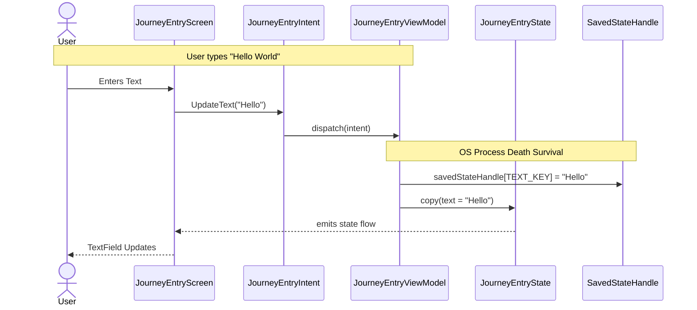

# Journey Entry Feature

## Domain-Specific Overview
The Journey application now includes a new **Entry Screen** that allows you, the user, to type in a multiline text about what's on your mind. A key feature of this text entry is that it survives when the application closes unexpectedly in the background (e.g., when the operating system needs to free up resources). This means you won’t lose what you were typing if you temporarily switch to heavy applications like the Camera or a Game.

## Technical Architecture

The architecture utilizes a strict Model-View-Intent (MVI) pattern combined with Dependency Injection via Koin. Crucially, the Compose Multiplatform UI communicates with the common `JourneyEntryViewModel`. We leverage Kotlin Multiplatform's `SavedStateHandle` to preserve the user's text continuously during operating system process deaths without requiring constant disk writes.

### Core MVI Components
- **JourneyEntryScreen**: The UI layer observing state via `collectAsStateWithLifecycle()`.
- **JourneyEntryIntent**: The sealed interface mapping user actions (e.g., `UpdateText`).
- **JourneyEntryState**: The data class holding the current `text` value.
- **JourneyEntryViewModel**: Processes the intent and manages the state persistence through `SavedStateHandle`.

### Flow of Data

