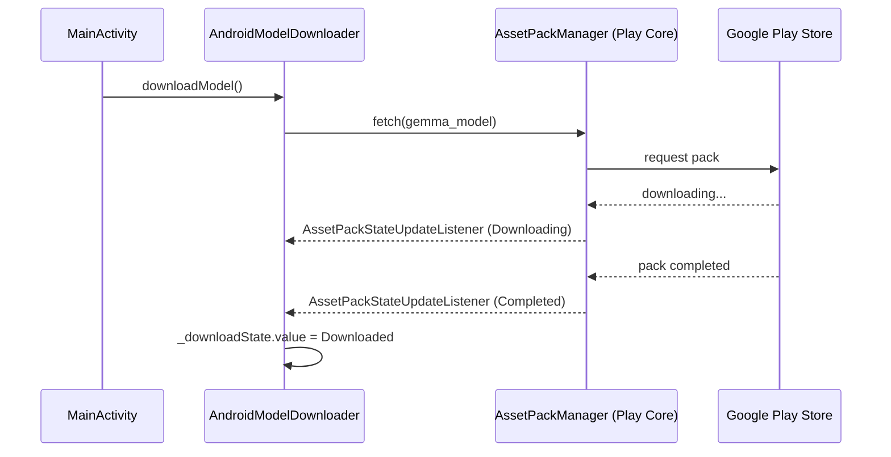

# Model Downloader

## Domain-Specific Overview
The Journey application uses an advanced Large Language Model (Gemma) to power its intelligent journaling text comprehension. Because the neural network model file is large (over 1 GB), we utilize Google Play Asset Delivery to seamlessly bundle it with the application.

When the application starts, it immediately verifies the presence of the model and begins downloading it transparently via the Google Play Store infrastructure if it is not already available. This ensures a fast initial download for the tiny core app and allows the large model to be securely and efficiently downloaded via Google's servers.

## Technical Architecture

The Model Downloader uses Google Play's `AssetPackManager` to handle the delivery of the `gemma_model` asset pack containing the `gemma-2b-it-gpu-int4.bin` file.

### Structure
- **`:gemma_model` Asset Pack**: Contains the `.bin` model file as an Android asset. It's configured to use `fast-follow` delivery type.
- **`ModelDownloader` Interface**: Located in `commonMain`, it exposes a `StateFlow<DownloadState>` indicating whether the download is `Idle`, `Downloading`, `Downloaded(path)`, or encountered an `Error`.
- **`AndroidModelDownloader`**: Located in `androidMain`. Uses the `AssetPackManager` API to trigger `fetch()` and listens for state updates.
- **`IosModelDownloader`**: Currently a stub, as Play Asset Delivery is Android-specific.

### Dependency Injection
We use Koin to inject the platform-specific implementations:
- `AndroidModelDownloader` receives the application context.
- The `MainActivity` immediately instructs the injected `ModelDownloader` to `downloadModel()` in its `onCreate` method, guaranteeing that the model fetch request happens as soon as the app process is live.

### Flow Diagram

