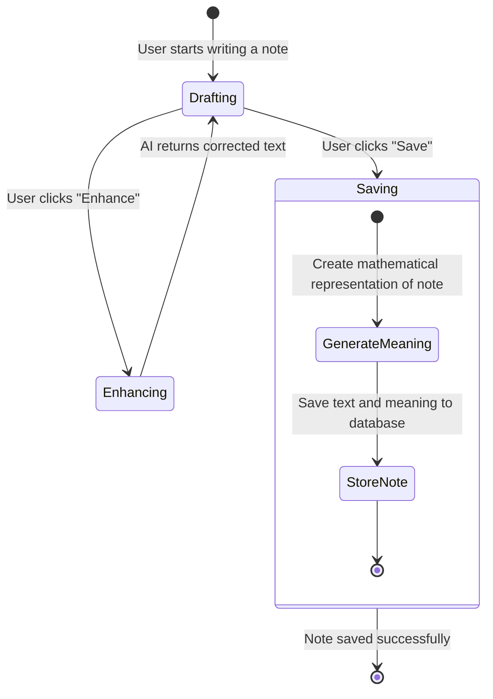
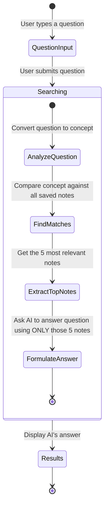

# Journey Domain Logic

This document describes the core business logic of the Journey application in simple terms. It explains how notes are created, enhanced, and searched.

## Note Creation and Enhancement

When a user writes a new note, they start in a drafting phase. Once they finish, they can choose to either save the note as it is or have the system enhance it. 

If they choose to enhance it, the system uses an AI assistant to gently correct spelling and grammar and ensure it reads as complete sentences, without changing the original meaning or adding new facts. The enhanced note replaces the drafted note, and the user can then save it.

When a note is saved, it is not just stored as text. The system also generates a "mathematical representation" (called a vector) of the note's meaning. This allows the system to understand the concept and context of the note later on.

### Note Creation Flow

## Searching Notes

The search feature goes beyond finding exact words. Because we save the "mathematical representation" of each note, the system can find notes that match the concept of what the user is looking for, even if they use different words.

When a user asks a question in the search bar, the system:
1. Converts the question into its mathematical representation.
2. Compares this question representation against all saved note representations.
3. Finds the 5 most conceptually similar notes.
4. Provides these 5 notes to the AI assistant along with the user's question.
5. The AI assistant reads only those specific notes and provides a direct answer to the question based solely on that information.

### Search Flow

