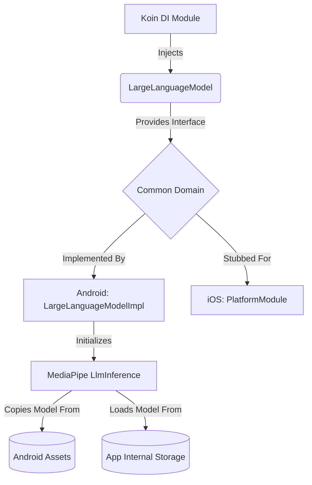

# MediaPipe Local LLM Integration

## Domain-Specific Section (For Non-Technical Stakeholders)

The "Journey" app now includes the foundational setup for a powerful AI assistant that runs entirely on your device. By integrating Google's MediaPipe framework, the application is capable of loading and understanding large language models (LLMs) locally.

**What does this mean for users?**
- **Privacy First:** Because the AI model runs locally on your device, your private notes and thoughts are never sent to a cloud server to be processed. Your data stays yours.
- **Offline Capability:** You won't need a constant internet connection to use the AI features. The assistant is ready to help you formulate and refine your thoughts whenever you need it.
- **Future-Proofing:** This initial integration lays the groundwork for upcoming features, such as our conversational semantic search, which will let you chat with the AI to instantly surface relevant past journal entries.

In short, the underlying "brain" of the app has been successfully installed, opening the door for smart note-taking enhancements without compromising security.

---

## Technical Section (For Developers)

The MediaPipe Large Language Model has been integrated into the "Journey" project using a Kotlin Multiplatform (KMP) architecture, aligning with the project's long-term goal of supporting both Android and iOS.

### Architectural Overview

### Key Components Added

1. **`LargeLanguageModel` Interface**: A platform-agnostic interface located in `commonMain` that defines a `suspend fun generateResponse(prompt: String): String`.
2. **`LargeLanguageModelImpl`**: The Android-specific implementation. 
    - It takes an Android `Context` and model name.
    - Inside its `init` block (running on an IO coroutine to prevent ANRs), it checks the app's internal file storage for the model file (e.g., `gemma-2b-it-cpu-int8.bin`). 
    - If the file does not exist, it securely copies it from the Android `assets` directory to the app's internal files directory because MediaPipe requires an absolute `.absolutePath` to load the `.bin` model via native C++ bindings.
    - It initializes the `LlmInference` client.
3. **Koin Integration**:
    - An `expect val platformModule: Module` was added in `KoinModule.kt`.
    - In `androidMain`, `platformModule` provides a singleton instance of `LargeLanguageModelImpl` initialized at startup (`createdAtStart = true`).
    - In `iosMain`, a stub implementation is provided, allowing the shared codebase to compile while the iOS variant awaits a concrete local model solution.

### How to Add the Model
To fully test the inference, download the Gemma model `.bin` file, place it in `composeApp/src/androidMain/assets`, and rename it to `gemma-2b-it-cpu-int8.bin` (or change the default parameter in the implementation). The app will automatically handle the loading mechanics upon startup.
