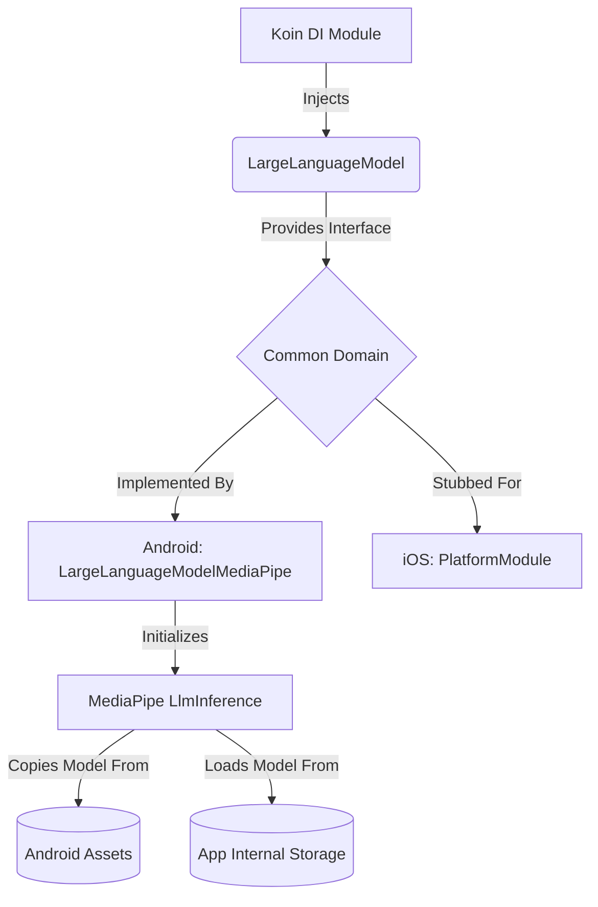
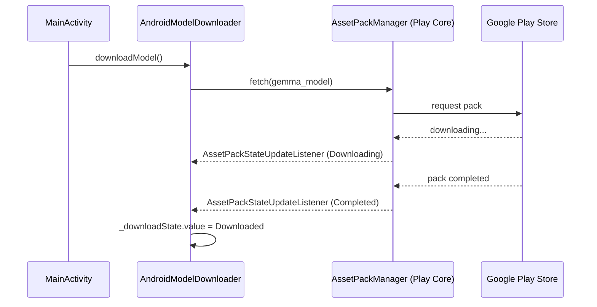

# Local LLM Integration

This document covers the implementation and delivery mechanisms for the local Large Language Model (LLM) powering the intelligence behind the Journey application.

## 1. Domain-Specific Documentation

The "Journey" app now includes the foundational setup for a powerful AI assistant that runs entirely on your device. By integrating Google's MediaPipe framework, the application is capable of loading and understanding large language models (LLMs) locally.

**What does this mean for users?**
- **Privacy First:** Because the AI model runs locally on your device, your private notes and thoughts are never sent to a cloud server to be processed. Your data stays yours.
- **Offline Capability:** You won't need a constant internet connection to use the AI features. The assistant is ready to help you formulate and refine your thoughts whenever you need it.
- **Future-Proofing:** This initial integration lays the groundwork for upcoming features, such as our conversational semantic search, which will let you chat with the AI to instantly surface relevant past journal entries.

In short, the underlying "brain" of the app has been successfully installed, opening the door for smart note-taking enhancements without compromising security.

### Model Delivery mechanism
The Journey application uses an advanced Large Language Model (Gemma) to power its intelligent journaling text comprehension. Because the neural network model file is large (over 1 GB), we utilize Google Play Asset Delivery to seamlessly bundle it with the application.

When the application starts, it immediately verifies the presence of the model and begins downloading it transparently via the Google Play Store infrastructure if it is not already available. This ensures a fast initial download for the tiny core app and allows the large model to be securely and efficiently downloaded via Google's servers.

---

## 2. Technical Documentation

The MediaPipe Large Language Model has been integrated into the "Journey" project using a Kotlin Multiplatform (KMP) architecture, aligning with the project's long-term goal of supporting both Android and iOS.

### Architectural Overview

### Key Components Added

1. **`LargeLanguageModel` Interface**: A platform-agnostic interface located in `commonMain` that defines a `suspend fun generateResponse(prompt: String): String`.
2. **`LargeLanguageModelMediaPipe`**: The Android-specific implementation. 
    - It takes an Android `Application` context and model name.
    - Inside its `init` block (running on an IO coroutine to prevent ANRs), it checks the app's external file storage (`getExternalFilesDir(null)`) for the model file (e.g., `gemma-2b-it-gpu-int4.bin`). 
    - If the file does not exist, it securely copies it from the Android `assets` directory to the app's external files directory because MediaPipe requires an absolute `.absolutePath` to load the `.bin` model via native C++ bindings.
    - It initializes the `LlmInference` client with a max tokens limit of 512.
3. **Koin Integration**:
    - An `expect val platformModule: Module` was added in `KoinModule.kt`.
    - In `androidMain`, `platformModule` provides a singleton instance of `LargeLanguageModelMediaPipe` initialized at startup (`createdAtStart = true`).
    - In `iosMain`, a stub implementation is provided, allowing the shared codebase to compile while the iOS variant awaits a concrete local model solution.

### How to Add the Model
To fully test the inference, download the Gemma model `.bin` file, place it in `composeApp/src/androidMain/assets`, and rename it to `gemma-2b-it-gpu-int4.bin` (or change the default parameter in the implementation). The app will automatically handle the loading mechanics upon startup.

### Play Asset Delivery Implementation

The Model Downloader uses Google Play's `AssetPackManager` to handle the delivery of the `gemma_model` asset pack containing the `gemma-2b-it-gpu-int4.bin` file.

#### Structure
- **`:gemma_model` Asset Pack**: Contains the `.bin` model file as an Android asset. It's configured to use `fast-follow` delivery type.
- **`ModelDownloader` Interface**: Located in `commonMain`, it exposes a `StateFlow<DownloadState>` indicating whether the download is `Idle`, `Downloading`, `Downloaded(path)`, or encountered an `Error`.
- **`AndroidModelDownloader`**: Located in `androidMain`. Uses the `AssetPackManager` API to trigger `fetch()` and listens for state updates.
- **`IosModelDownloader`**: Currently a stub, as Play Asset Delivery is Android-specific.

#### Dependency Injection
We use Koin to inject the platform-specific implementations:
- `AndroidModelDownloader` receives the application context.
- The `MainActivity` immediately instructs the injected `ModelDownloader` to `downloadModel()` in its `onCreate` method, guaranteeing that the model fetch request happens as soon as the app process is live.

#### Flow Diagram

