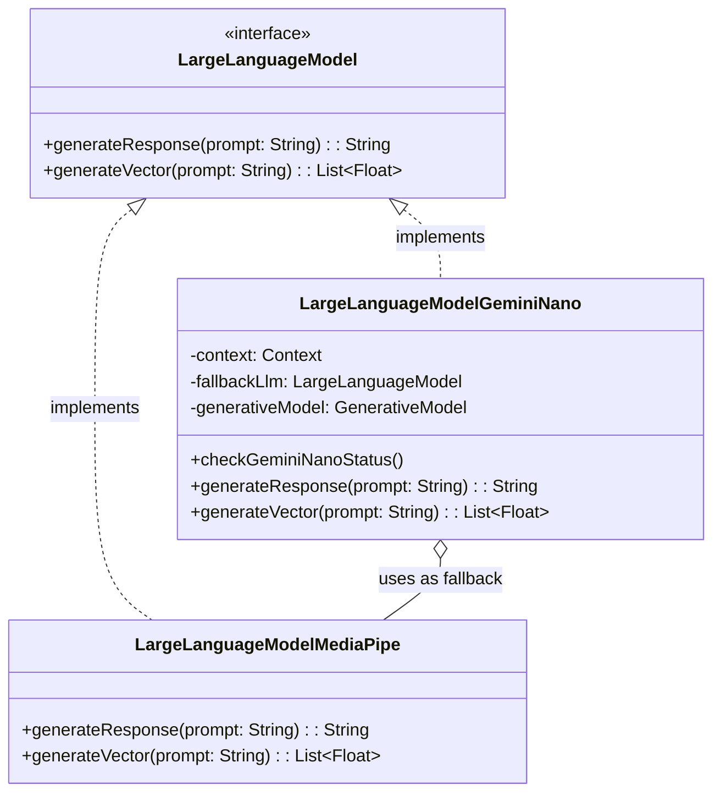
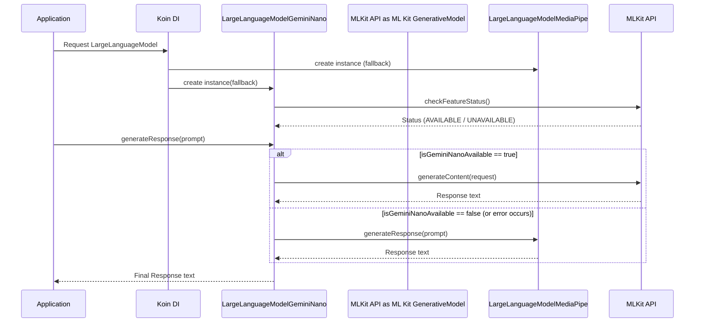

# Gemini Nano On-Device ML Implementation

## Overview
This feature introduces on-device Large Language Model (LLM) capabilities utilizing Google's newer **ML Kit GenAI Prompt API**, addressing issue #13. By running the model directly on the user's device, Journey ensures data privacy and offline usability. The `com.google.mlkit:genai-prompt` library is favored over Android AICore because of its custom prompt flexibility and stable interface.

## Domain Model
The `LargeLanguageModel` interface guarantees decoupled interactions between the application layer and the underlying machine learning implementations.

## Technical Architecture

### Component Interaction (Initialization & Inference)
The `LargeLanguageModelGeminiNano` relies heavily on ML Kit `GenerativeModel`. When a request comes in, the availability of Gemini Nano is checked. If it is not supported or not downloaded, the class falls back to the previous `LargeLanguageModelMediaPipe` solution.

### Build & Dependency Considerations
- The implementation requires raising the project `minSdk` to **26** due to the ML Kit Prompt API (`1.0.0-beta1`) dependencies.
- Vector generation (`generateVector`) currently delegates entirely to the fallback mechanism since text embeddings are not natively exposed in the `genai-prompt` subset.
