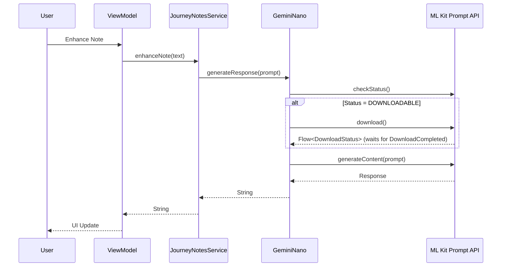

# Gemini Nano Integration

## Domain-Specific Overview
The Journey app now supports **Gemini Nano**, Google's highly efficient on-device AI model. 
This means that wherever possible, the app will process your notes and queries directly on your device without sending any data to the cloud.
- **Privacy First**: Because Nano runs directly on your phone, your private journal entries remain entirely on your device.
- **Offline Support**: You can enhance notes or search your journals even without an active internet connection.
- **Smart Fallback**: If your device isn't compatible with Gemini Nano, the app automatically falls back to an alternative on-device processor (MediaPipe), ensuring you always have a seamless experience.

## Technical Architecture
We introduced the `LargeLanguageModelGeminiNano` class, implementing the `LargeLanguageModel` interface, which relies on the ML Kit GenAI Prompt API for Android.

### Dependency Injection
Using Koin inside `PlatformModule.kt`, we dynamically determine availability during the app initialization. If the `Generation` client reports that the feature is `UNAVAILABLE`, Koin injects `LargeLanguageModelMediaPipe` as a reliable fallback. Otherwise, `LargeLanguageModelGeminiNano` takes precedence.

### Download Flow
To avoid blocking the application startup, large multi-gigabyte models are downloaded lazily upon the first feature request.
If the status is `DOWNLOADABLE`, the `generateResponse()` invocation suspends execution, requests the download natively, captures the `DownloadCompleted` state using Kotlin Flows, and resumes the generation.

### System Diagram

