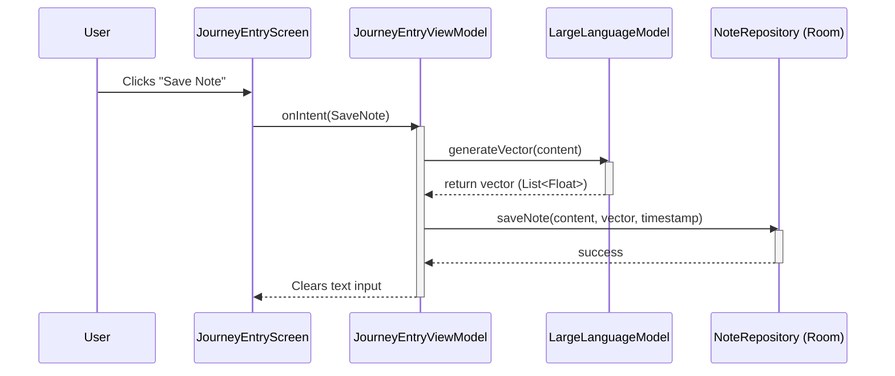

# Save Notes to Database

## Domain-Specific Section
This feature allows users to securely save the notes they create in the Journey app directly to their local device storage. By saving notes locally, users can access their past thoughts and journaling entries at any time, even without an internet connection. Additionally, each note is processed by an advanced local Artificial Intelligence model to capture its underlying semantic meaning (represented as a "vector"). This empowers future features like searching through old notes based on the meaning or theme, rather than just matching exact words! To keep track of history, every saved note automatically records the exact date and time it was created.

## Technical Section
### Architecture Changes
The feature introduces a local persistence layer using **Room Database** and integrates it with our existing **MediaPipe LLM** implementation for semantic embeddings.

1. **Entity & DAO Implementation**:
    - Added `NoteEntity` incorporating `content` (String), `vectorJson` (String representation of List<Float>), and `timestamp` (Long).
    - Added `NoteDao` for standard inserting and fetching functionality.
    - Added `AppDatabase` to define the database schema and configurations using Room `2.8.4` for Kotlin Multiplatform compatibility.
2. **Repository Layer**:
    - Created `NoteRepository` interface in `commonMain` to maintain platform agnosticism.
    - Implemented `NoteRepositoryImpl` in `androidMain` which acts as the intermediary between the local database and the app, injecting `NoteDao` via Koin.
3. **LLM Vector Generation**:
    - Enhanced the `LargeLanguageModel` interface with a `generateVector()` function.
    - Implemented vector extraction natively within `LargeLanguageModelMediaPipe`.
4. **Presentation and DI**:
    - Injected `NoteRepository` and `LargeLanguageModel` into `JourneyEntryViewModel`.
    - Bound these new services within `PlatformModule.kt`.
    - Handled the actual `SaveNote` Intent within `JourneyEntryViewModel` utilizing Coroutines for asynchronous DB commits and semantic generation.

### Logic Flow

